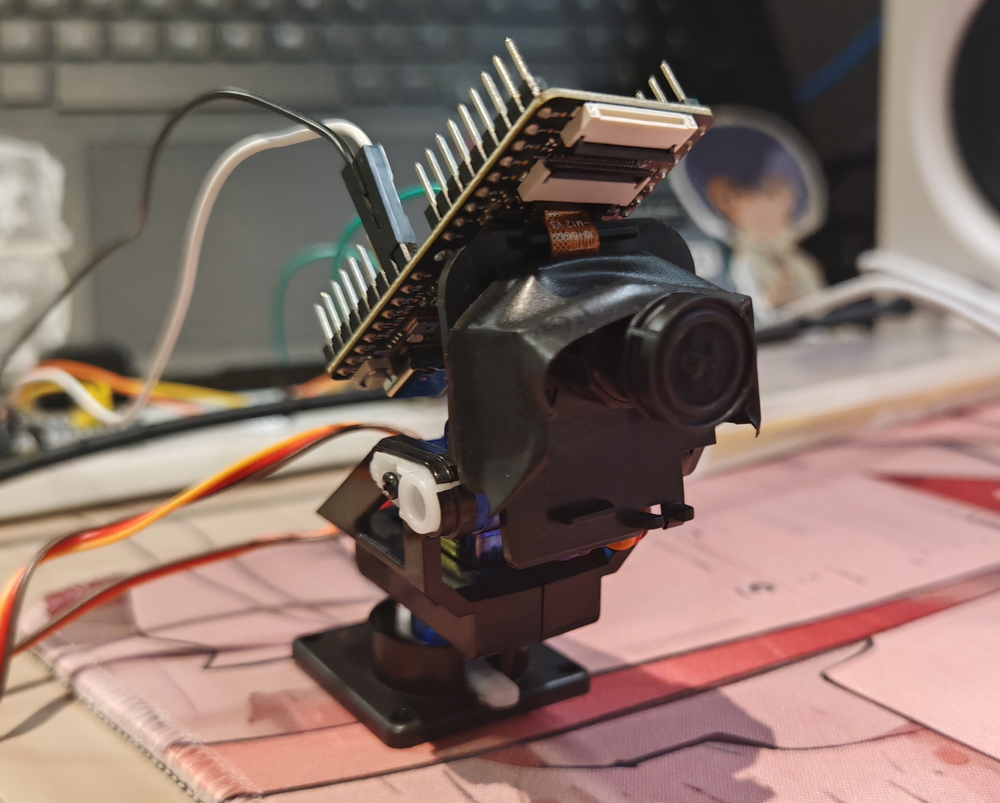

# 基于YOLOv2的目标跟踪云台(K210+STM32)
嵌入式EdgeAI招新项目--目标跟踪云台

## 项目概况

一个基于yolov2的利⽤PID算法控制舵机移动摄像头实现实时跟踪特定物体的云台。

### 运行环境

- 器件：K210 MaixBit，STM32F103C8T6，M12摄像头，舵机云台，两个sg90舵机，STLinkV2。
- 开发环境：MaixPy IDE, Keil uVision5
- 烧录环境：kflash_gui
- 串口调试环境：XCOM

### 演示模型

演示模型为**绿灯**，采用云平台`Maixhub`训练模型：http://maixhub.com/

**数据集**

- 标签：`green`
- 训练集/验证集：285/32
- 标签数量：317

**图像增强**

- 随机镜像：关
- 随机旋转：关

- 随机模糊：开
- 缩放方式：contain
- 缩放宽度：224
- 缩放高度：224

- 平均值：123.5

- 标准差：58.395

**模型信息**

- 部署平台：nncase

- 模型类型：transfer_learning

- 模型网络：yolov2

- 主干网络：mobilenet_0.75

**训练参数**

- 训练次数：100

- 批量大小：32

- 学习率：0.001

- 标注框限制：10

- 数据均衡：关

- 允许负样本：关

**训练结果**

在验证集上第100次训练迭代有最佳准确率：0.909。 

### PID算法

PID是一种闭环控制算法，以实现对目标值的精确控制。由P、I、D三种算法组成,通过不同组合达到不同控制效果。

P算法（比例控制）：`Kp`为参数，`ek`代表误差。误差越大，P的输出越大。P算法的作用是**减小测量值和理论值之间的差值**，使其不断接近理论值。

D算法（微分控制）：`Kd`为参数，`ek-e(k-1)`为两次误差插差值。D算法的作用为阻尼，如果系统误差太大，P输出会过大，使用D算法可以**抑制P算法过冲现象**。

I算法（积分控制）：`Ki`为参数，`ej的和`为误差累加。I算法的作用是消除稳态误差。当误差接近0时，P输出会很小，导致误差无法减小到0。通过I算法累加误差值并输出。**I算法常用于更精确的控制**，无需求的情况下可以不用I算法。

## 硬件代码

### **STM32F103C8T6**

STM32的Keli项目位于`/hardware/STM32`中，其主要外设源码位于`/hardware/STM32/Hardware`中，结构如下：

> edgeAI_Target-tracking-gimbal/ 
>
> ├── hardware/ 
>
> │   	├── K210_with_model
>
> │  	 └── STM32
>
> │   		└── Library
>
> │   		└── Start
>
> │   		└── User
>
> │   				└── main.c
>
> │   		└── System
>
> │   				└── PID.c
>
> │   				└── PID.h
>
> │   		└── Hardware
>
> │   				└── OLED.c
>
> │   				└── OLED.h
>
> │   				└── OLED_Font.h
>
> │   				└── PWM.c
>
> │   				└── PWM.h
>
> │   				└── Serial.c
>
> │   				└── Serial.h
>
> │   				└── Servo.c
>
> │   				└── Servo.h

`OLED`用于OLED显示屏，`PWM`用于两个舵机的PWM控制，`Servo`用于舵机PWM控制的函数封装，`Serial`用于与PC端和K210端的USART通信配置。

项目的PID算法位于`/hardware/STM32/System/PID.c`中，通过传参（目标预期位置，目标实际位置）至PID算法实时控制舵机的摆动，从而控制摄像头位置。

### K210 MaixBit

K210的python源文件(`boot.py`)和模型(`greenlight.kmodel`)位于`/hardware/K210_with_model`中，结构如下：

> edgeAI_Target-tracking-gimbal/ 
>
> ├── hardware/ 
>
> │   	├── K210_with_model
>
> │   		└── boot.py
>
> │   		└── greenlight.kmodel
>
> │  	 └── STM32

K210对图像进行yolov2检测，获取目标坐标，并通过串口实时发送给STM32进行PID算法处理，达到实时追踪的功能。

## 项目演示

出于云台性能原因，本项目仅演示云台水平方向（x轴）的动态追踪功能。竖直方向（y轴）附在代码注释中。

云台识别出演示模型（绿灯），并成功实时追踪。

演示视频`demo.mp4`位于`demo`文件夹中。

<video src="demo/demo.mp4"></video>

